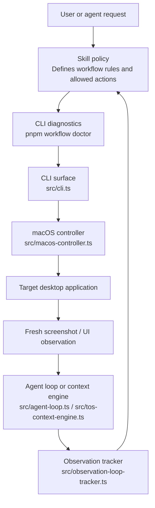

# Desktop AI Loop Engineering

An experiment in AI workflow automation, visual decision loops, and reusable
macOS desktop control.

## Disclaimer

This repository is intended for educational and research purposes related to
AI-assisted desktop workflows. Users are responsible for complying with the
Terms of Service of any software they automate.

## Overview

This project packages four ideas into one reusable framework:

- loop engineering for reliable agent behavior
- visual AI workflows that reason over fresh screenshots
- skill-based desktop automation on macOS
- contextual UI detection for guarded, resolution-independent actions

The repository is structured for people who want to study or extend:

- desktop automation primitives
- agent loops with explicit stop conditions
- skill-driven orchestration
- recovery-aware UI workflows

## Features

- Visual observe-decide-act-verify loop for UI automation
- macOS controller for app launch, focus, screenshots, clicks, and key presses
- Skill folders that document policy separately from implementation
- Loop-state tracker that requires repeated confirmation before completion
- Normalized click presets for known Tree of Savior M Extreme controls
- Region-of-interest color detection with confidence thresholds and an optional
  AI fallback
- CLI harness for repeatable local testing
- Reusable skills for generic desktop loops, Spotlight launching, and the
  Tree of Savior M Extreme main-quest workflow

## How It Works

The core agent pattern is:

`Observe -> Decide -> Act -> Verify`

1. Observe
   Capture fresh UI state from the target application.
2. Decide
   Classify the current state and choose the highest-priority next action.
3. Act
   Perform one meaningful action through the controller.
4. Verify
   Capture a new observation and confirm the result before continuing.

This loop reduces brittle script behavior by checking reality after every step
instead of assuming that a click, key press, or wait completed the workflow.

## Architecture

The repository separates policy, control, and state tracking:



### Components

- `src/cli.ts` exposes the command surface used by skills and local experiments.
- `src/macos-controller.ts` handles app launch, focus, screenshots, pointer
  input, and keyboard input.
- `src/agent-loop.ts` demonstrates a reusable loop with explicit
  state-to-action mapping.
- `src/observation-loop-tracker.ts` enforces safe completion through repeated
  fresh observations.
- `src/tos-presets.ts` maps named TOS actions to normalized window coordinates.
- `src/macos-image-sampler.ts` samples pixels from normalized screenshot regions
  with macOS Core Graphics.
- `src/tos-context-engine.ts` combines region detectors, confidence thresholds,
  click/wait decisions, and an optional AI fallback.
- `skills/run-tree-of-savior-m-extreme-quests/SKILL.md` defines the persistent,
  safety-constrained main-quest workflow.

## Skill System

Skills are the human-readable policy layer. They describe:

- when a workflow should run
- what to inspect on screen
- which actions are allowed
- how to recover from failures
- when the loop is allowed to stop

That makes the decision logic auditable without burying everything inside
controller code.

The included skills are:

- `run-tree-of-savior-m-extreme-quests`: runs the visible yellow main-quest loop
  through Computer Use, including fellow and auto-potion checks, reward handling,
  recovery, token-efficient observation, and a three-observation completion rule
- `run-visual-desktop-loop`: provides the reusable controller-backed
  observe-decide-act-verify pattern
- `launch-app-via-spotlight`: launches and verifies an installed macOS app using
  Spotlight

The TOS skill intentionally uses Computer Use as its primary runtime. The
repository's `tos-detect` and `tos-click` commands are diagnostics and
experimentation surfaces; the skill does not silently switch to them during its
normal game loop.

## TOS Context Detection

The contextual detector evaluates a normalized region of a screenshot instead
of assuming a fixed pixel resolution. Each detector returns a confidence score.
The engine chooses the strongest result above its configured threshold, maps
known actionable states to a guarded click preset, and otherwise waits. An AI
classifier can be supplied as a fallback when deterministic detectors are not
confident enough.

The current CLI detector recognizes the yellow quest card by color within the
quest-tracker region:

```bash
pnpm workflow window-screenshot artifacts/tos-current.png "TOSM TH"
pnpm workflow tos-detect artifacts/tos-current.png
pnpm workflow tos-click yellow-quest artifacts/tos-current.png "TOSM TH"
```

`tos-click` also supports `quest-accept`, `quest-action`, and `fellow-menu`.
Always capture a fresh window screenshot before acting; normalized coordinates
protect against resolution changes, but not against stale or unexpected UI
state.

## Agent Loop

Loop engineering matters most in workflows where UI state can drift. Common
examples include:

- email processing and inbox triage
- repetitive data entry across internal tools
- dashboard monitoring with escalation actions
- routine desktop tasks that require verification after each step

The included loop examples favor:

- fresh observations over cached assumptions
- named states over vague heuristics
- one action per iteration
- explicit completion checks
- recovery rules for blocked or unknown states

## macOS Automation

The controller targets macOS and depends on:

- Accessibility permission for input control
- Screen Recording permission for screenshot capture

Example commands:

```bash
pnpm install
pnpm workflow doctor
pnpm workflow launch "Notes"
pnpm workflow focus "Notes"
pnpm workflow window-screenshot artifacts/current-window.png "Notes"
pnpm workflow window-click 640 420 artifacts/current-window.png "Notes"
pnpm workflow tos-detect artifacts/tos-current.png
pnpm workflow tos-click yellow-quest artifacts/tos-current.png "TOSM TH"
pnpm test
```

## Repository Layout

- `skills/` source workflow skills for Codex and related agents
- `src/` controller and loop implementation
- `test/` coverage for loop and controller behavior
- `scripts/nemo.mjs` interactive skill symlink installer

Install or refresh the skills interactively with:

```bash
pnpm install
pnpm nemo symlink
```

The installer can symlink selected skills into project-local or global skill
directories for Codex, Claude Code, Cursor, and Gemini CLI.

## Safety Considerations

- Verify software Terms of Service before automating it.
- Prefer reversible actions and explicit confirmation points.
- Re-capture screenshots after every state-changing action.
- Avoid hardcoding personal paths, credentials, or machine-specific settings.
- Verify each installed skill still matches your intended repository boundary.

## Future Roadmap

- Add more reusable skills for email, monitoring, and data-entry flows
- Add more deterministic TOS detectors for reward, action, transition, and idle
  states
- Calibrate detector regions and confidence thresholds against more window sizes
- Expand test fixtures for screenshot-driven workflows
- Add structured telemetry for loop decisions and recovery behavior
- Package the controller and skill templates for easier onboarding
